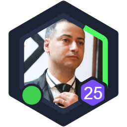

<p align="center">
  
</p>


[](https://www.npmjs.com/package/polyavatar)


# What it is
Simple plygin to generate polygonal avatars with customization options.

## How to install
Copy the file to your project

## Quick Start
1. Create a canvas element with the desired width:

``` html
<canvas class="polyavatar" width="256" height="256"></canvas>
```
2. Instantiate the plugin poiting to the canvas element
``` javascript
var newInstance = new PolygonAvatar({
    selector: '.polyavatar'
})
```

3. Enjoy the result



## Options

The plugin can be configured using the one of a combination of the following options:

| Parameter        |  Default  | Mandatory |                                             Description                                             |
|:------------------|:---------:|:---------:|:---------------------------------------------------------------------------------------------------|
| selector         |     ''    |     x     | A CSS selector to the destination canvas to render.                                                 |
| sides            |     6     |           | How many sides (more than 2, of course) the polygon should have.                                    |
| image            |     ''    |           | Sets the image to be rendered inside the polygon.                                                   |
| percentage       | 0.98      |           | The percentage of the progress bar around the image.                                                |
| progressBarColor | '#4ff461' |           | The color of the progress bar.                                                                      |
| showProgress     | true      |           | If the avatar should render the progressbar                                                         |
| animated         | true      |           | If the progress bar will be animated until it reaches the target percentage                         |
| online           | undefined |           | The online status of the user. Omitting it will not generate the status indicator.                  |
| levelNumber      | undefined |           | The level of the user. It will be shown as a smal polygon on the right with the level number in it. |

## Contributing
Please read this [style guidelines](https://github.com/joemottershaw/style-guidelines) documentation project and please follow the [contribution guidelines](./.github/CONTRIBUTING.md) and [code of conduct](./.github/CODE_OF_CONDUCT.md).

## License
This project is open-sourced and licensed under the [MIT License](./LICENSE).
